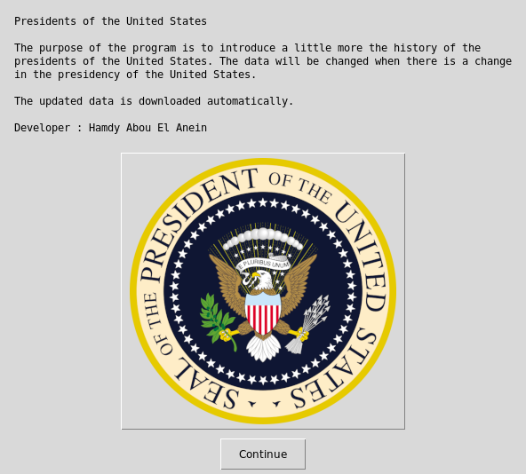
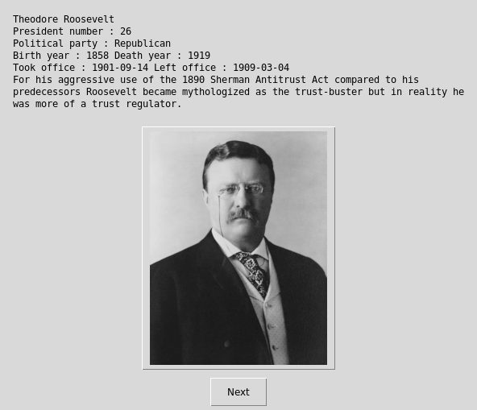
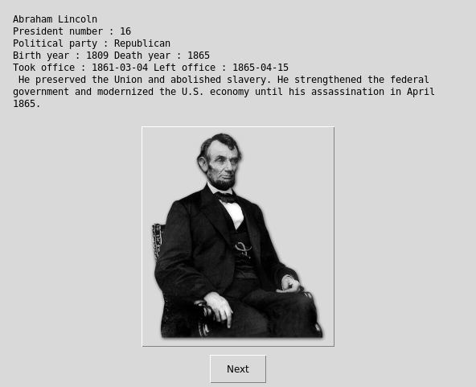

   

# Presidents of the United States history




 


## What's this software ?  

The purpose of this Python3 program is to introduce a little more the history of the presidents of the United States. 

## Particularity

The data will be changed when there is a change in the presidency of the United States. The data is downloaded to the software automatically so you never need to update it.

## Download the Windows .exe version :

You can run it with Python 3 and the right libraries or for Windows you can use the .exe software that I created there :

[](https://sourceforge.net/projects/usa-presidents-history/files/latest/download)
[](https://sourceforge.net/projects/usa-presidents-history/files/latest/download)


## What you need to make it work :  


The last version of Python 3.

you also need to have the easygui library for python 3:

At least the version 0.98

```sh
sudo python3 -m pip install --upgrade easygui 
```

You need wget for python 3:


```sh
sudo pip3 install wget
```


## How to launch this software :  

```sh
python3 presidents.py
```  

## Requirements :

If you miss a module, install it with the command pip install module-name. For example if you miss PIL you can install it with : sudo pip3 install pillow.


## Developer - Author

Hamdy Abou El Anein

## Homepage

http://www.daylightlinux.ch 
